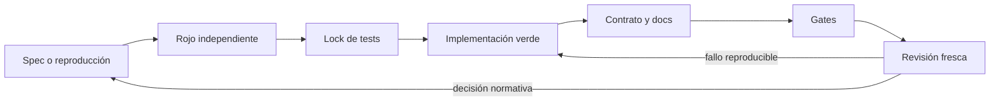

# Workflow de desarrollo con Codex

Este documento es la referencia operativa del flujo de agentes de Lodestar. Conserva spec primero,
TDD independiente, contrato explícito y revisión fresca, pero aplica esas garantías de forma
proporcional al riesgo y las refuerza con scripts verificables.

## Principios

1. **Spec suficiente antes de comportamiento nuevo.** Una feature usa historia ratificada; un bug
   inequívoco puede usar issue o reproducción estable.
2. **Rojo independiente.** Un agente define pruebas a partir de la spec, no de una solución.
3. **Verde con tests bloqueados.** El implementador no puede cambiar los ficheros aceptados en rojo
   sin romper un hash.
4. **Entregable completo antes de juzgar.** Código, tests, contrato, docs y estado entran juntos en
   el expediente.
5. **Revisión fresca por evidencia.** Los jueces no reciben intención ni razonamiento del autor.
6. **Integración separada de corrección.** Rama, commit, push y PR son acciones explícitas, no
   condiciones de Done.

## Jerarquía de autoridad

1. `ARCHITECTURE.md`.
2. `docs/REFACTOR_PHASE_2.md` y `ARCHITECTURE.md §20`.
3. Historias ratificadas de `requirements/`.
4. Decisiones abiertas de `decisiones/`.
5. `contracts/mcp.yml`.
6. `IMPLEMENTATION_STATUS.md`.

El prototipo de `prototype/` solo documenta v0.2.x. No resuelve discrepancias del producto actual.

## Nivel de proceso

| Nivel | Ejemplos | Flujo |
| --- | --- | --- |
| Docs o mecánico | typo, formato, movimiento sin semántica | Cambio directo, check específico, revisión del diff. |
| Bugfix | comportamiento observado contrario a una regla inequívoca | Reproducción, rojo, fix, gates, revisión fresca. |
| Historia | nueva conducta acotada | Ratificación, rojo/verde separados, contrato/docs, gates, revisión. |
| Arquitectura | nuevo subsistema, invariante o varias historias | `$planificar`, dos ratificaciones, historias individuales. |

Una tarea sube de nivel si toca contrato MCP, dependencias, rutas, concurrencia, publicación,
recuperación o decisiones abiertas.

## Piezas

| Capa | Ubicación | Responsabilidad |
| --- | --- | --- |
| Instrucciones estables | `AGENTS.md` | Autoridad, invariantes, riesgo y acciones de integración. |
| Skills | `.agents/skills/` | Workflows públicos: planificar, especificar, ciclo, revisar y mutantes. |
| Agentes | `.codex/agents/` | Roles especializados con esfuerzo y sandbox propios. |
| Enforcement | `scripts/` | Alcance, hashes, contrato, guidance y gates. |
| CI | `.github/workflows/ci.yml` | Puertas independientes de plataforma y release. |

Los roles que escriben heredan el modelo de la sesión y usan `workspace-write`. Las tres lentes de
revisión se configuran con `read-only`. La configuración de `.codex/` requiere que el checkout esté
marcado como proyecto confiable en Codex.

## Secuencia de una historia o bug



### Rojo

El orquestador toma un inventario previo:

```bash
mkdir -p target/agent-state
python3 scripts/phase-scope.py snapshot target/agent-state/pre-red.json
```

`autor_tests` solo puede escribir tests de integración y fixtures. Después:

```bash
python3 scripts/phase-scope.py verify-tests-only target/agent-state/pre-red.json
```

La comprobación compara contenido, creación, borrado y modo de fichero. Cualquier cambio de
producción rompe la fase. Esto excluye stubs y tests inline del circuito separado; un test inline
comparte fichero con la implementación y no se puede bloquear sin bloquear también el verde.

El rojo es válido solo si el test falla por el comportamiento buscado. Un error de preparación, un
fixture ausente o una assertion que nunca se alcanza no sirven como evidencia.

### Lock

Tras aceptar el rojo, bloquear exactamente las pruebas y fixtures usados:

```bash
python3 scripts/tdd-test-lock.py snapshot \
  target/agent-state/tests.json \
  crates/lodestar-mcp/tests/mi_historia.rs
```

El implementador y el orquestador verifican antes y después:

```bash
python3 scripts/tdd-test-lock.py verify target/agent-state/tests.json
```

Cambiar una assertion, un helper o un fixture bloqueado obliga a volver a un autor fresco,
demostrar otro rojo y regenerar el lock.

### Verde y reparaciones

`implementador` recibe spec, nombres exactos de tests rojos y ruta del lock. Implementa la mínima
conducta suficiente, actualiza contrato/docs afectados y comunica los gates sin cambiar tests.

- Bug inequívoco dentro del alcance: reparar y repetir automáticamente.
- Test contrario a una spec inequívoca: arbitrar con `juez_tests` fresco.
- Spec ambigua o decisión abierta: pedir criterio al usuario.
- Reparación aceptada: repetir lock, gates y juicio con agentes nuevos.

## Contrato MCP

La comprobación se divide en dos capas.

### Estructura mecanizable

`scripts/check-contract-surface.py` compara, en orden:

- las tools registradas por `tools::list()`;
- los brazos de `tools::call()`;
- las entradas de `contracts/mcp.yml`;
- `CHANGE_TOOLS` frente a los perfiles de escritura;
- presencia de `inputSchema` y `outputSchema` en las diez tools.

`scripts/agent-gates.sh contract` añade los tests Rust existentes que parsean el YAML y ejercitan
parámetros, schemas, valores de wire y guardas anti-vacuidad.

### Semántica

`juez_arquitectura` revisa errores, invariantes, efectos de escritura, compatibilidad y conducta.

- Con delta ratificado, manda la spec.
- Sin delta ratificado, una divergencia entre código y contrato bloquea.
- El código no puede convertir por sí solo un accidente en norma actualizando el YAML.

## Gates

| Comando | Contenido |
| --- | --- |
| `scripts/agent-gates.sh contract` | Superficie estática + tests estructurales MCP. |
| `scripts/agent-gates.sh policy` | Guidance vigente, contrato estático, pureza y dependencias retiradas, fuente única de errores. |
| `scripts/agent-gates.sh full` | fmt, clippy estricto, build de targets, workspace tests, dos suites `test-failpoints`, doc, policy y demo smoke en Linux. |

El gate completo refleja las puertas de CI que `cargo test --workspace` no cubre por sí solo. No
omitir `lodestar-workspace` ni `lodestar-app` con la feature `test-failpoints`.

## Revisión

`$revisar` construye un expediente con la spec, los cuatro estados del diff (committed contra
`develop`, staged, unstaged y nuevos), autoridades y evidencia cruda.

| Juez | Pregunta |
| --- | --- |
| `juez_correccion` | ¿Se cumple cada criterio con comportamiento y documentación demostrables? |
| `juez_arquitectura` | ¿Se preservan invariantes, dependencias, transacciones, rutas y contrato? |
| `juez_tests` | ¿El rojo fue auténtico y la suite detectaría una implementación incorrecta? |

La síntesis no usa votación pesimista:

- criterio incumplido, invariante roto o fallo reproducible: bloquea;
- riesgo plausible sin evidencia suficiente: exige investigación;
- sospecha especulativa: no bloquea por mayoría;
- hallazgos duplicados: se fusionan conservando sus fuentes.

Un bugfix pequeño usa corrección y tests. Una historia o cambio de superficie protegida usa las
tres lentes. Docs mecánicas pueden revisarse directamente.

## Git e integración

La sesión parte de un checkout o worktree basado en `develop`. El resultado normal es un diff
verde y revisado. Solo crear ramas, commits, pushes o PRs cuando el usuario lo pida explícitamente.
`main` queda reservado al runbook de release de `RELEASING.md`.

## Referencias de Codex

- [AGENTS.md](https://developers.openai.com/codex/agent-configuration/agents-md)
- [Subagentes y agentes personalizados](https://developers.openai.com/codex/agent-configuration/subagents)
- [Skills](https://developers.openai.com/codex/build-skills)
- [Configuración de proyecto](https://developers.openai.com/codex/config-basic)
- [Sandbox y aprobaciones](https://developers.openai.com/codex/agent-approvals-security)
