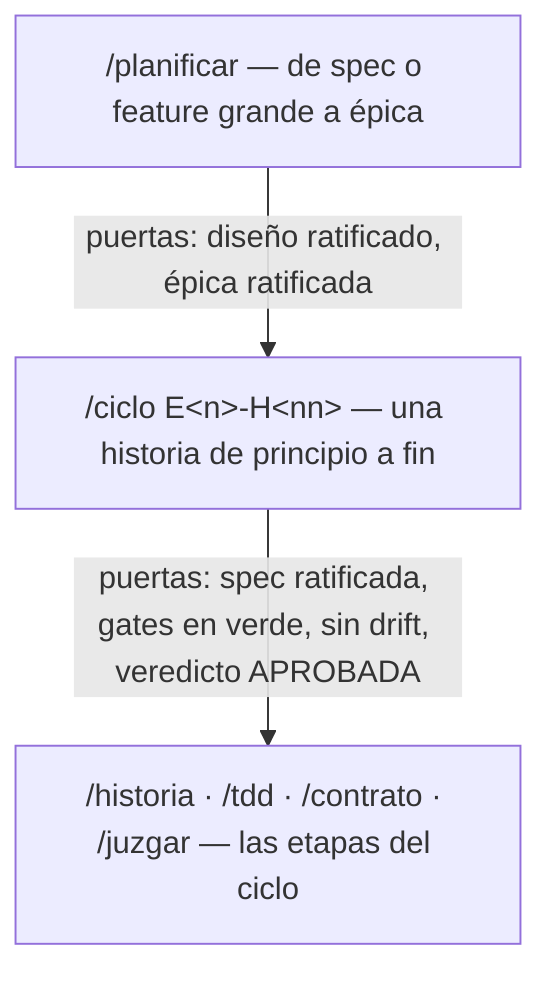
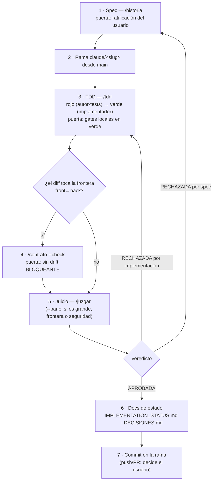

# Workflows de desarrollo — la guía explicativa

> Este documento explica **cómo se desarrolla en lodestar y por qué el proceso es así**: los
> cuatro pilares, cómo se encadenan agentes y skills, y qué recorrido seguir según el tipo de
> trabajo. La **referencia operativa** (tablas exactas, reglas del orquestador) vive en
> [`.claude/README.md`](../.claude/README.md); el detalle de cada skill, en su
> `SKILL.md` (`.claude/skills/<nombre>/`). Si este documento y aquellos discrepan, manda la
> referencia operativa.

> **El motor es headless** (`ARCHITECTURE.md §19`, giro `E9`–`E14`): `frontend/` y `src-tauri/`
> quedan **CONGELADOS** — ningún skill del flujo (`/ciclo`, `/historia`, `/ux`) los modifica en v2.
> El **circuito UX** de la §5 (`/ux`, agente `disenador-ux`) queda **documentado pero no aplicable
> al giro headless**: se conserva como referencia (igual que git quedó dormido en `lodestar-vcs`),
> por si la UI vuelve a evolucionar más adelante. Las épicas `E10`+ introducen el crate
> **`lodestar-app`** (servicios de caso de uso compartidos por las fachadas; ver `CLAUDE.md` y
> `ARCHITECTURE.md §19.2`) — todavía no existe, pero cuando aparezca sus historias siguen este
> mismo proceso.

## 1. Por qué este proceso

El flujo se apoya en cuatro pilares. Cada uno existe para cerrar una vía de error concreta:

**SDD — spec primero.** Nada se implementa sin una historia ratificada en
[`requirements/`](../requirements/) (formato `E<n>-H<nn>`). El problema que cierra: el "código
primero" convierte cada PR en una negociación sobre qué se pidió. Con historia ratificada, la
discusión ocurre *antes* de escribir código, cuando cambiar de opinión cuesta minutos; la historia
es inmutable durante su implementación (si resulta defectuosa, se refina y se re-ratifica — no se
reinterpreta en caliente).

**TDD con separación de poderes.** El agente `autor-tests` escribe los tests de la historia y
demuestra que **fallan por la razón correcta** (rojo); el agente `implementador` los pone en verde
pero **tiene prohibido modificarlos**. Si cree que un test está mal, para y lo reporta — el
orquestador lo devuelve al autor-tests, nunca arbitra el código él mismo. El problema que cierra:
cuando la misma mano escribe test e implementación, el test tiende a describir lo que el código
hace, no lo que la spec pide.

**BDD sin Gherkin ejecutable.** Los criterios de aceptación de comportamiento se escriben como
escenarios `Dado / Cuando / Entonces` y **cada escenario mapea a un test Rust nombrado** (p. ej.
`Entonces el check es OKF-FM01 → test: fm01_falta_frontmatter`). No hay cucumber-rs ni runner
Gherkin: el arnés diferencial JS-vs-Rust (`prototype/harness/` +
`crates/lodestar-core/tests/differential.rs`) ya es el oráculo de comportamiento vivo, y un runner
duplicaría maquinaria.

**Jueces ciegos.** Antes de commitear, el trabajo lo revisa un agente **fresco** que recibe
únicamente la spec, el diff y las rutas de los docs de autoridad — jamás resúmenes de la
conversación, justificaciones ni el razonamiento del implementador. La ceguera es la garantía de
imparcialidad: un juez que conoce la intención hereda los sesgos de quien implementó y aprueba por
empatía. Corolarios: un veredicto RECHAZADA se re-juzga con un juez **nuevo** (no se negocia con
el mismo), y el orquestador tampoco escribe código durante `/tdd` para no contaminar lo que luego
describe.

## 2. El mapa de piezas

Siete agentes con poderes deliberadamente separados:

| Agente | Rol en una frase |
|---|---|
| `planificador` | Convierte una spec/diseño mayor en una épica de historias ordenadas (dos puertas). |
| `historiador` | Redacta historias `E<n>-H<nn>` con criterios BDD y delta de contrato. |
| `autor-tests` | Fase ROJA: escribe los tests y verifica que fallan. No toca código de producción. |
| `implementador` | Fase VERDE: pone los tests en verde. No puede modificarlos. |
| `juez-historia` | Juez ciego: solo spec + diff, veredicto criterio a criterio. |
| `guardian-contrato` | Coherencia de las 5 superficies de la frontera front↔back. |
| `disenador-ux` | **No aplicable al giro headless** (UI congelada). Experto UX: flujos, mockups y auditorías contra buenas prácticas. Solo escribe en `design/`. Documentado, no se invoca en v2. |

Ocho skills que los orquestan:

| Skill | Qué entrega |
|---|---|
| `/planificar` | Diseño ratificado + épica de historias ordenadas por dependencias. |
| `/historia` | Una spec ratificable en `requirements/`. |
| `/tdd` | La historia implementada (rojo → verde → gates locales). |
| `/contrato` | Informe (`--check`) o sincronización de la frontera front↔back. |
| `/juzgar` | Veredicto ciego (1 juez, o panel de lentes con `--panel`). |
| `/mutantes` | Gaps reales de la suite (mutantes supervivientes) + tests propuestos. |
| `/ux` | **No aplicable al giro headless** (UI congelada) — spec visual ratificable en `design/` (flujos, mockups) o auditoría UX. No se invoca en v2. |
| `/ciclo` | Todo lo anterior encadenado: de necesidad a commit juzgado. **No toca `frontend/`/`src-tauri/`** en v2. |

## 3. La pirámide del flujo

Cada nivel tiene su puerta de ratificación; ninguna se salta:

- **`/planificar`** es la puerta de entrada de las features grandes (p. ej. una sección de
  `DECISIONES.md`). Trabaja en dos fases con puertas separadas — **diseñar y trocear son
  ratificaciones distintas**: un buen diseño puede estar mal descompuesto, y viceversa. Fase A:
  propuesta de diseño anclada en `ARCHITECTURE.md` (ratificada → adenda al doc). Fase B:
  descomposición en `requirements/epica-NN-<slug>.md` con orden de construcción y trazabilidad.
- **`/ciclo`** consume la épica historia a historia, en orden de construcción.
- Si el trabajo **cabe en una historia**, se entra directamente por `/ciclo` (que empieza por
  `/historia`) sin pasar por `/planificar` — no toda necesidad merece una épica.

## 4. Anatomía de `/ciclo`

El camino de una historia, con sus puertas y sus vueltas atrás:

Qué pasa cuando una puerta falla: **se vuelve atrás con el artefacto corregido, nunca se negocia
en caliente**. Un RECHAZADA por defecto de implementación devuelve a `/tdd`; por defecto de spec,
a `/historia` (refinar y re-ratificar). En ambos casos el re-juicio lo hace un juez **fresco**.
La regla de oro del ciclo: el coste de re-ratificar una spec es minutos; el de un invariante roto
en `main`, no.

Al cierre, dos opcionales: `/mutantes --file <módulos tocados>` para medir si la suite nueva
muerde, y `/simplify` si el verde dejó complejidad evidente.

## 5. El circuito UX (no aplicable al giro headless — UI congelada)

> **Motor headless (`ARCHITECTURE.md §19.1`, `E9-H04`)**: mientras lodestar sea un motor sin GUI,
> este circuito **no se invoca** — `frontend/`/`src-tauri/` están congelados y no hay UI nueva que
> especificar. La descripción que sigue documenta cómo funcionaba (y cómo funcionaría si la UI
> vuelve a evolucionar), igual que `§13` de `ARCHITECTURE.md` documenta git dormido.

La UI nueva (pantallas o interacciones que el prototipo no tiene) pasaba por su propio circuito,
**antes** de `/historia` — un flujo/mockup ratificado es a la UI lo que la historia al código:

1. **`/ux flujo <desc>`** produce el flujo de usuario como `design/flujos/<slug>.excalidraw`
   (versionable; cubre camino feliz **y** caminos de error/cancelación). Si además hace falta
   verlo, **`/ux mockup`** genera bocetos HTML autocontenidos en `design/mockups/` — **uno por
   pantalla/estado** (`--vacio`, `--error`…), nunca una réplica navegable de la app.
2. El usuario **ratifica** los artefactos; la historia (`/historia`) los cita en sus Referencias,
   y así autor-tests, implementador y juez los reciben como spec visual.
3. En el juicio, `/juzgar --panel` añade **automáticamente** (sin flag) la lente de fidelidad UX
   si el diff toca `frontend/` y la historia cita artefactos de `design/`: el juez ciego verifica
   estados cubiertos, tokens CSS del prototipo y fidelidad al patrón ratificado. Sin artefactos no
   hay lente — un juez UX sin spec visual opinaría desde el gusto.

El principio de diseño detrás: **patrón conocido por defecto** (ley de Jakob — el público es
técnico y ya sabe usar VS Code, GitHub y Obsidian); un patrón nuevo solo se admite si el artefacto
declara qué patrón conocido descarta y por qué paga su coste de aprendizaje. El tercer modo,
**`/ux audit`**, audita la UI existente contra el checklist de buenas prácticas del agente
(heurísticas de Nielsen, estados obligatorios, accesibilidad). Convenciones y ciclo de vida de los
artefactos: [`design/README.md`](../design/README.md).

## 6. Recetas por tipo de trabajo

**Feature grande** (no cabe en una historia): `/planificar` primero — cierra el diseño y produce
la épica — y después `/ciclo E<n>-H01`, `/ciclo E<n>-H02`… en el orden de construcción, saltando
las marcadas `[BLOQUEADA por DECISIONES §N]`.

**Feature que cabe en una historia**: `/ciclo <descripción>` directo. En v2, `/ciclo` no toca
`frontend/`/`src-tauri/` (UI congelada, `§19.1`).

**Trabajo con UI nueva**: **no aplica en v2** — la UI está congelada; no hay circuito de entrada
por `/ux` mientras el motor sea headless (ver §5).

**Bugfix**: no hace falta historia completa. Test de regresión primero (rojo: reproduce el bug) →
fix (verde) → `/juzgar` simple con el issue como spec. Si el bug es de paridad con el prototipo,
el test va además al arnés diferencial o a la sección «Regresiones de paridad con el prototipo»
de `core.rs`.

**Refactor**: los tests existentes son la red. `/mutantes` con el mismo alcance **antes y
después**: si tras el refactor sobreviven mutantes que antes morían, la suite se debilitó.
`/simplify` para el pulido final.

**Cambio en la frontera front↔back** (`core::types`, `src-tauri`, `lodestar-mcp`,
`frontend/src/lib/ipc/`): siempre `/contrato --check` antes del PR, y `/juzgar --panel`. Mientras
`frontend/src/lib/ipc/types.ts` sea espejo manual (hasta ts-rs, `DECISIONES.md §4`), `/contrato`
es la única red que detecta su deriva.

**Release**: runbook de [`RELEASING.md`](../RELEASING.md) — sin skill, ya está resuelto.

## 7. Las reglas que no se negocian

- **Nada se implementa sin historia ratificada**; el implementador no toca los tests; los jueces
  nunca reciben contexto de la conversación; las puertas que fallan devuelven atrás, no se
  discuten en caliente.
- **Decisiones de proceso ya tomadas** (no relitigar sin motivo): BDD sin cucumber-rs (el arnés
  diferencial es el oráculo), mutation testing a demanda sin CI, y `contracts/*.yml` describe
  superficie y semántica pero **los tipos viven solo en `core::types`** (invariante #4 de
  [`CLAUDE.md`](../CLAUDE.md)).
- **Mapa de autoridad documental** — quién manda sobre qué:
  [`ARCHITECTURE.md`](../ARCHITECTURE.md) sobre el diseño (sus tablas §10/§12 zanjan
  contradicciones); [`DECISIONES.md`](../DECISIONES.md) lista lo abierto a criterio del usuario
  (los agentes proponen, nunca deciden); [`IMPLEMENTATION_STATUS.md`](../IMPLEMENTATION_STATUS.md)
  el estado real por épica (se actualiza en el mismo PR que cierra o abre trabajo);
  [`prototype/index.html`](../prototype/index.html) es la spec de comportamiento que el core porta
  1:1 — y para la UX, los artefactos ratificados de [`design/`](../design/README.md).
